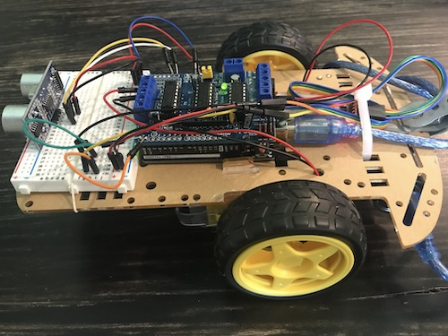
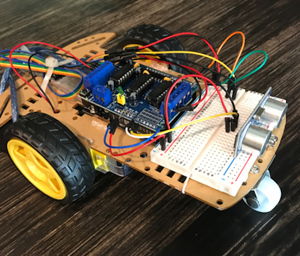

# Arduino Robot Car ~ 2020

The purpose of this project was to create a fully functional robot using an Arduino Uno microcontroller. The robot performs certain maneuvers based on input from a Bluetooth terminal application. The robot has an optional autonomous mode which when activated, will cause the robot to drive forward, redirecting its route only when the ultrasonic sensor detects an object within 10 cm.

### Functionality

The Arduino is responsible for commanding all parts of the robot. The robot's HC-SR04 ultrasonic sensor and HC-08 Bluetooth module are connected to the Arduino's analog and digital pins respectively. The Arduino is powered via a USB-connected power bank. The L293D motor controller shield plugs into the top of the Arudino and operates the motors on the chassis.

All actions performed by the robot are due to input from a Bluetooth terminal application. When specific characters are sent via Bluetooth to the robot's HC-08 module, corresponding actions are performed.

### Coding

The program to control the robot was written in the Arduino IDE in C++. The AFMotor.h library provided simultaneous speed and directional motor control. The NewPing.h library delivered ultrasonic sensor functionality. The SoftwareSerial.h library was leveraged to allow serial communication between a Bluetooth terminal and the Arduino via the HC-08.

### Final Product

https://www.dropbox.com/s/4fgv8d03ylhvlvf/RobotCar.mp4?dl=0
