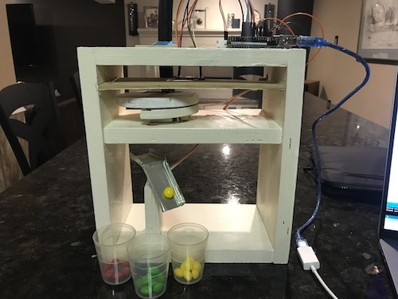

# Arduino Color Sorter ~ 2020

The purpose of this project was to create a system that would sort small objects based on color. Two micro servo motors were used in this project; one to pick up the Skittles, and one to drop them into designated cups. A TCS230 color sensor was used to differentiate between red, green, and yellow skittles.

### Color Sensor Functionality

The color sensor contains 64 evenly distributed red, green, blue, and clear photodiodes which are responsible for color readings. The TCS230's readings are converted from current to frequency, allowing the Arduino to discern skittle color. A website that assisted my understanding of the TCS230 can be found [here](https://howtomechatronics.com/tutorials/arduino/arduino-color-sensing-tutorial-tcs230-tcs3200-color-sensor/).

### Coding

The program to control the robot was written in C++ in the Arduino IDE. The Servo.h library promoted micro servo control. Both micro servos could be rotated an inputted degree amount with the use of the library's write() function. The TCS230 color sensor made use of the pulseIn() function which would read the sensors detected output color frequency. These readings were compared against pre-determined frequency numbers that corresponded to each color.

### Final Product

Video of the color sorter:

[https://www.dropbox.com/s/g9dgkcebrm6pitt/ColorSorter.mp4?dl=0](https://www.dropbox.com/s/g9dgkcebrm6pitt/ColorSorter.mp4?dl=0)
