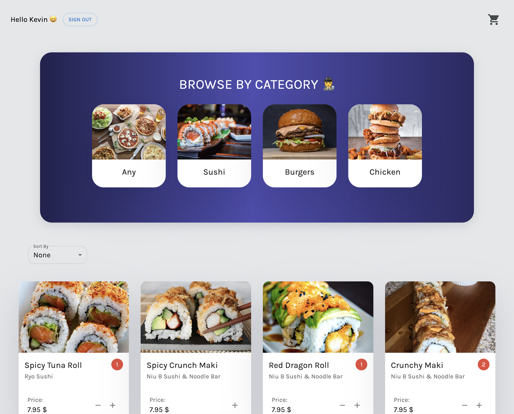
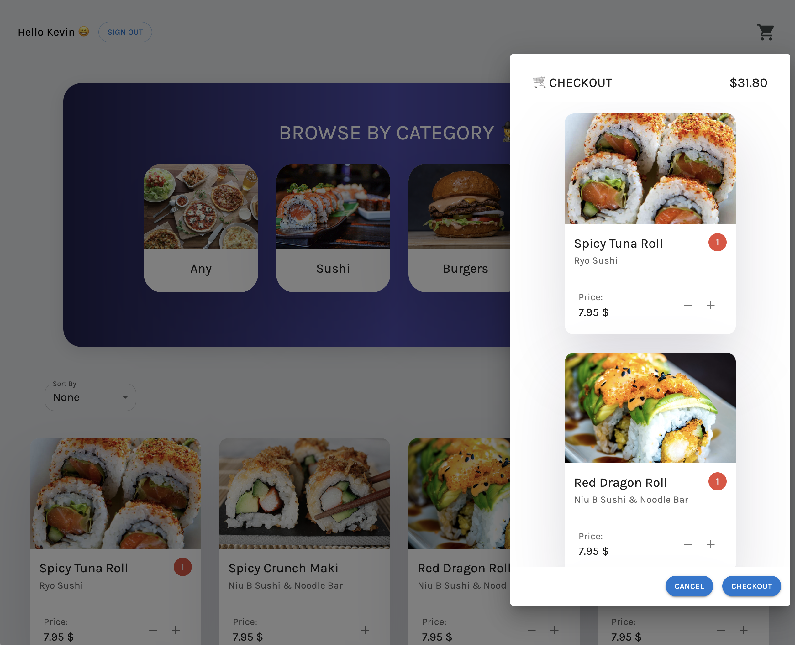

# Food Delivery App ~ 2022

A mock food delivery app, allowing users to login, browse, and check out desired items. GraphQL API was written in TypeScript using NestJS framework, and Prisma ORM, to serve React Typescript frontend. Application data is stored in PostgreSQL database. JWT authentication exists to protect certain endpoints. Unit and end-to-end tests are written for backend using Jest and Supertest.

### Server

`npm run start` or `docker-compose up —build` to start server. Go to [localhost:3001/graphql](http://localhost:3001/graphql) to query Apollo playground.

User is given an access token and refresh token when they sign in. Refresh token is hashed (with bcrypt) and stored in database. JWT access token expires after 600 seconds. The refreshTokens endpoint exists to refresh user’s access token via the user’s refresh token.

The .env file should contain DATABASE_URL, AT_SECRET, RT_SECRET, POSTGRES_USER, POSTGRES_PASSWORD, and POSTGRES_DB.

### Client

`npm run start` or `docker-compose up —build` to start react app at [localhost:3000](http://localhost:3000).

Create an account and sign in, or use the following user credentials: username: Kevin, password: 87654321.
