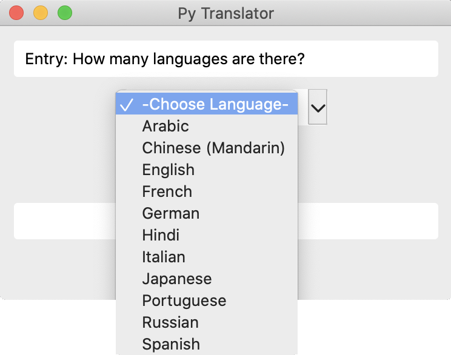
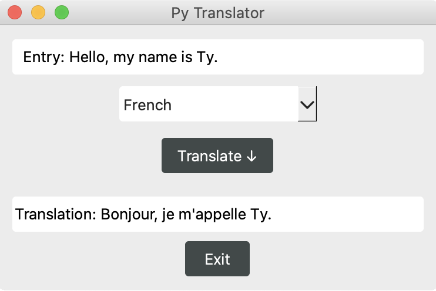

~ 2020

A graphical user interface displaying the translation of user inputs in selected languages.

The code for this project was written in Python leveraging the PyQt5 and googletrans libraries.

The GUI prompts a user to input a sentence. Once completed, a list of 11 languages is given. The user's entry is then translated into the chosen language and displayed. The user can then select a different translation or quit the GUI. The tutorials on [realpython.com](https://realpython.com/python-pyqt-gui-calculator/) and [learnpyqt.com](https://www.pythonguis.com/pyqt-tutorial/) assisted me in the effective use of PyQt and in the creation of .dmg and .exe files for users.

### Final Product

