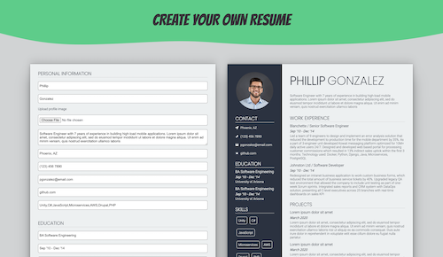

My first project using React.js (2021).

An intuitive React web application to create your own CV/Resume.

Users fill out the form with personalized information as content in the resume is simultaneously updated. Users can pick custom colors for their resume and then export to pdf once completed.

Inspiration for this project was found while following the tutorials on https://www.theodinproject.com/dashboard and advancing to the cv-application section
