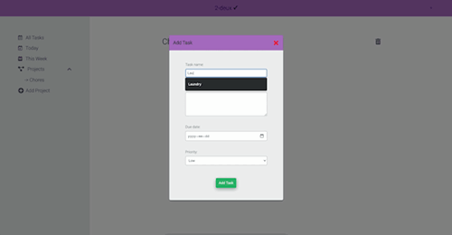

First project using JavaScript (2021). A todo list app where users can add custom todos with descriptions, due dates, and priority levels. Filter through tasks via project subfolders.

Inspiration for this project was found while following the tutorials on https://www.theodinproject.com/dashboard and advancing to the todo-list section.
